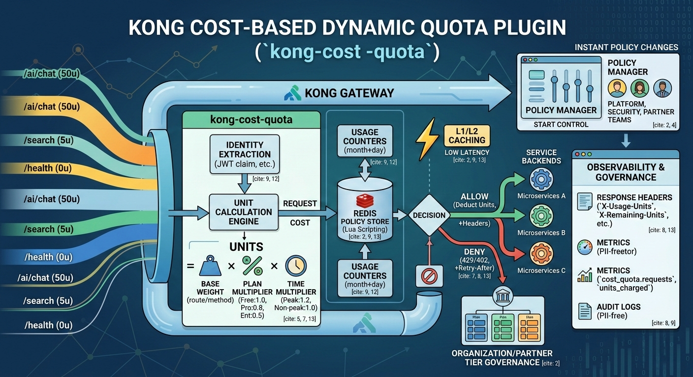

# BudgetGuard (`kong-cost-quota`)

Kong 커스텀 플러그인으로, 요청 수(RPS)가 아니라 **비용 유닛(Unit)** 기준으로 API 사용량을 통제합니다.  
정책은 Redis에 저장하고, Kong 내부 L1/L2 캐시를 사용해 저지연으로 집행합니다.



## 1. 핵심 기능

- 비용 기반 쿼터 집행: `units = base_weight * plan_multiplier * time_multiplier * custom_multiplier`
- 식별자 기반 정책 적용: `client_id` 또는 `org_id` 필수
- 정책 매칭 우선순위:
1. `route_id`
2. `service + path_prefix`
3. `method + path_regex`
4. `default`
- Redis Lua 원자 차감(`EVAL/EVALSHA`)으로 동시성 정확성 보장
- 장애 전략: `fail_open` / `fail_closed` + 서킷브레이커
- 관측성:
  - 응답 헤더
  - 구조화 메트릭 로그
  - 감사 로그
- 롤아웃 제어:
  - `shadow`
  - `partial`
  - `enforce`
- 긴급 토글:
  - 특정 `client_id` 강화/완화
  - 정책 캐시 TTL 단축

## 2. 실행 구조

### 2.1 단계

- `access`: 정책 조회, 유닛 계산, 사용량 차감, allow/deny 결정
- `log`: 감사 이벤트 기록

### 2.2 식별자 추출 우선순위

1. JWT claim (`org_id`, `client_id`, `plan`)
2. mTLS cert subject/serial
3. API Key consumer id
4. Trusted header (`X-Org-Id`, `X-Client-Id`, `X-Plan`)  
   - `allow_trusted_identity_headers=true`일 때만 허용

## 3. 데이터 모델

### 3.1 Redis 키

- 정책 키: `policy:{env}:{scope}:{id}`
- 사용량 키: `usage:{env}:{window}:{scope}:{id}:{bucket}`
  - `window`: `month`, `day`
  - TTL: UTC 기준 윈도우 종료 + grace day

### 3.2 정책 JSON 예시

```json
{
  "version": "v2026-02-27",
  "deny_status_code": 429,
  "default": {
    "base_weight": 2,
    "plan_multiplier": 1.0,
    "time_multiplier": 1.0,
    "custom_multiplier": 1.0,
    "budget": 100
  },
  "rules": {
    "by_route_id": {
      "route-123": {
        "base_weight": 10,
        "plan_multiplier": 1.0,
        "time_multiplier": 1.0,
        "custom_multiplier": 1.0,
        "budget": 50
      }
    },
    "by_service_path_prefix": [
      {
        "service": "svc-main",
        "path_prefix": "/v1/ai",
        "base_weight": 8,
        "plan_multiplier": 1.0,
        "time_multiplier": 1.0,
        "custom_multiplier": 1.0
      }
    ],
    "by_method_path_regex": [
      {
        "method": "POST",
        "path_regex": "^/v1/chat",
        "base_weight": 12,
        "plan_multiplier": 1.0,
        "time_multiplier": 1.0,
        "custom_multiplier": 1.0
      }
    ]
  },
  "plan_multipliers": {
    "pro": 0.8,
    "enterprise": 0.5
  }
}
```

## 4. 주요 설정

전체 스키마는 [`kong/plugins/kong-cost-quota/schema.lua`](kong/plugins/kong-cost-quota/schema.lua)에서 확인할 수 있습니다.

- 기본 동작:
  - `deny_status_code` (`402|429`)
  - `allow_trusted_identity_headers`
  - `audit_log_enabled`
- Redis:
  - `redis_host`, `redis_port`, `redis_database`, `redis_password`
  - `redis_timeout_ms` (`5~20`)
  - `redis_env`
- 장애 처리:
  - `failure_strategy` (`fail_open|fail_closed`)
  - `failure_deny_status` (`429|503`)
- 사용량/차감:
  - `usage_grace_days`
  - `redis_policy_required`
  - `redis_atomic_enabled`
- 캐시:
  - `policy_cache_enabled`
  - `policy_cache_ttl_sec` (`30~120`)
  - `emergency_mode`
  - `policy_cache_ttl_emergency_sec` (`5~10`)
  - `policy_cache_shm`
  - `policy_cache_version_probe_sec`
- 서킷브레이커:
  - `circuit_breaker_enabled`
  - `circuit_failure_window_sec`
  - `circuit_min_requests`
  - `circuit_failure_threshold`
  - `circuit_open_sec`
  - `redis_circuit_shm`
- 롤아웃:
  - `rollout_mode` (`shadow|partial|enforce`)
  - `partial_enforce_route_ids`
  - `partial_enforce_service_names`
  - `partial_enforce_client_ids`
- 긴급 토글:
  - `emergency_target_client_ids`
  - `emergency_action` (`none|tighten|relax`)
  - `emergency_multiplier`
  - `emergency_cache_ttl_sec` (`5~10`)

## 5. 관측성

### 5.1 응답 헤더

- `X-Usage-Units`
- `X-Remaining-Units`
- `X-Budget-Window` (현재 구현: `day`)
- `Retry-After` (deny 시)
- `X-Policy-Version`
- `X-Policy-Source` (`cache|redis|default`)

### 5.2 메트릭 로그 이벤트

`cost_quota_metric` 구조화 로그로 출력됩니다.

- `cost_quota.requests{result=allow|deny,source=cache|redis|default}`
- `cost_quota.units_charged`
- `cost_quota.redis_latency_ms`
- `cost_quota.policy_cache_hit`

### 5.3 감사 로그 이벤트

`cost_quota_audit` 구조화 로그로 출력됩니다.

- `client_id`, `org_id`, `route_id`
- `units`, `remaining`
- `policy_version`, `policy_source`
- `decision`, `reason`
- `rollout_mode`, `rollout_enforced`, `emergency_applied`

## 6. 설치/활성화 예시

환경에 따라 방식이 다를 수 있으므로 아래는 일반적인 Kong 로컬/컨테이너 예시입니다.

1. 플러그인 코드가 Kong Lua 로드 경로에 포함되도록 배치
2. `KONG_PLUGINS`에 플러그인 등록
3. `nginx_http_lua_shared_dict`에 캐시/서킷 dict 확보

예시:

```bash
export KONG_PLUGINS="bundled,kong-cost-quota"
```

`kong.conf` 예시:

```conf
plugins = bundled,kong-cost-quota
nginx_http_lua_shared_dict = kong_cost_quota_cache 32m
nginx_http_lua_shared_dict = kong_cost_quota_circuit 8m
```

## 7. 운영자 실배포 절차 (선언형 설정 기준)

아래 예시는 decK 기반 운영 흐름입니다.

### 7.1 사전 점검

1. Redis 연결 확인 (`redis_host`, `redis_port`, `redis_database`, 인증)
2. Kong shared dict 설정 확인 (`kong_cost_quota_cache`, `kong_cost_quota_circuit`)
3. 정책 키 유효성 확인 (`policy:{env}:{scope}:{id}`)

### 7.2 1단계: Shadow 배포

차단 없이 관측만 수행합니다.

```yaml
plugins:
  - name: kong-cost-quota
    config:
      rollout_mode: shadow
      redis_host: 127.0.0.1
      redis_port: 6379
      redis_env: prod
      failure_strategy: fail_open
      policy_cache_enabled: true
      policy_cache_ttl_sec: 60
```

적용 명령 예시:

```bash
deck gateway sync -s kong.yaml
```

검증:

1. 차단 응답(429/402) 발생 없음
2. `cost_quota_metric`, `cost_quota_audit` 로그 확인
3. 응답 헤더(`X-Usage-Units`, `X-Policy-Source`) 확인

### 7.3 2단계: 부분 적용(Partial Enforce)

특정 route/service/client만 enforce합니다.

```yaml
plugins:
  - name: kong-cost-quota
    config:
      rollout_mode: partial
      partial_enforce_route_ids:
        - route-checkout
      partial_enforce_service_names:
        - svc-payment
      partial_enforce_client_ids:
        - partner-premium-001
      redis_host: 127.0.0.1
      redis_port: 6379
      redis_env: prod
```

검증:

1. 타깃 트래픽만 차단 규칙 enforce
2. 비타깃 트래픽은 shadow allow
3. 감사 로그의 `rollout_enforced` 값으로 대상/비대상 구분 확인

### 7.4 3단계: 전면 적용(Enforce)

```yaml
plugins:
  - name: kong-cost-quota
    config:
      rollout_mode: enforce
      redis_host: 127.0.0.1
      redis_port: 6379
      redis_env: prod
      failure_strategy: fail_open
```

검증:

1. 예산 초과 요청에 대해 429/402 정상 반환
2. `Retry-After` 및 remaining 헤더 확인
3. 메트릭에서 deny 비율/소스 분포 확인

### 7.5 4단계: 긴급 토글 (특정 client_id 강화/완화 + TTL 단축)

#### 강화(tighten) 예시

```yaml
plugins:
  - name: kong-cost-quota
    config:
      rollout_mode: enforce
      emergency_target_client_ids:
        - partner-highrisk-009
      emergency_action: tighten
      emergency_multiplier: 2.0
      emergency_cache_ttl_sec: 5
```

#### 완화(relax) 예시

```yaml
plugins:
  - name: kong-cost-quota
    config:
      rollout_mode: enforce
      emergency_target_client_ids:
        - partner-critical-001
      emergency_action: relax
      emergency_multiplier: 0.5
      emergency_cache_ttl_sec: 5
```

검증:

1. 대상 `client_id`만 유닛 강화/완화 반영
2. 정책 소스가 짧은 주기로 `redis`로 재조회되는지 확인(TTL 단축 효과)
3. 감사 로그의 `emergency_applied=true` 확인

### 7.6 롤백 절차

가장 안전한 기본 롤백은 shadow 전환 + 긴급 토글 해제입니다.

```yaml
plugins:
  - name: kong-cost-quota
    config:
      rollout_mode: shadow
      emergency_target_client_ids: []
      emergency_action: none
      emergency_multiplier: 1.0
```

적용 후 검증:

1. 차단 해제 확인
2. 관측 로그 정상 수집 확인

## 8. 테스트 실행

`busted` 기반 테스트를 사용합니다.

```bash
busted spec
```

현재 테스트 범위:

- Unit: 식별/매칭/유닛 경계값
- Integration: 동시성(1,000+), 컷오프/TTL 정확성
- Failure: Redis 다운/타임아웃/권한 오류
- Load: 캐시 적중률/지연 목표 검증
- Rollout: shadow/partial/enforce/긴급 토글

## 9. 디렉터리 구조

```text
kong/plugins/kong-cost-quota/
  handler.lua         # access/log 훅, 롤아웃/관측성
  schema.lua          # 플러그인 설정 스키마
  policy_model.lua    # 정책 정규화/검증
  route_matcher.lua   # 우선순위 매칭
  unit_calculator.lua # 유닛 계산
  decision.lua        # allow/deny 결정
  redis_store.lua     # 정책 조회/사용량 차감/원자 스크립트
  policy_cache.lua    # L1/L2 캐시 + version probe
  failure_control.lua # 장애 전략 + 서킷브레이커

spec/kong/plugins/kong-cost-quota/
  *_spec.lua          # 단위/통합/장애/부하/롤아웃 테스트
```
